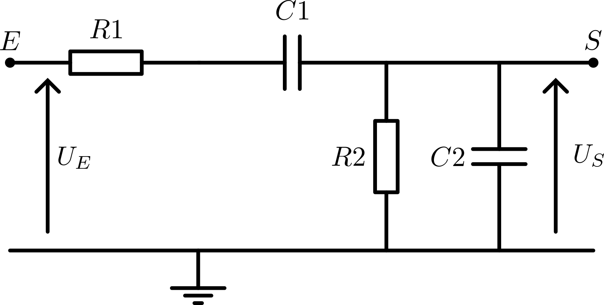

# Filtre analogique

Quel filtre choisir ?

Nous savons que nous utiliserons des fréquences entre 20 et 25 kHz. Sachant que nous utilisons un système d'audio conférence. il ne devrait pas y avoir des communications autre que notre transmition sur les fréquence supérieur à 20kHz. Il est ainsi simple d'utiliser un filtre passe haut. Dans les cas ou nous ne somme pas les seul à communiquer de cette façon, nous pouvons utiliser un filtre pass bande. Mais cette possibilité étant peu probable. Nous allons nous contenter d'un simple filtre passe haut.

Nous avons ainsi besoin d'un filtre passe-haut
En nous inspirant du prosit 2, nous pouvons utiliser le même filtre avec des composants de différentes valeurs.

Soit $P_f$ la plage de fréquences transmises. (ex. $P_f = [20, 20.6]$kHz).

Dans le cas ou nous utilisons un pass haut. Nous pourrons définir la fréquence de coupure $f$ comme $f=\min(P_f)$. Or, pour s'assurer que nous pourrons capter proprement le signal. Nous pouvons placer la fréquence de coupure un peut avant. (ex. $f = 19$kHz).

Nous pouvons déplacer les composants pour refaire sous la forme d'un pont diviseur de tension

On sait que :
$$
\underline{U_S} = \frac {\underline{Z_B}} {\underline{Z_A} + \underline{Z_B}} U_E
$$

Nous pouvons déterminer $\underline{Z_A}$ et $\underline{Z_B}$

$$
\underline{Z_A} = \underline{Z_{R1}} + \underline{Z_{C1}}
$$

et
$$
\frac 1 {\underline{Z_{B}}} = \frac 1 {\underline{Z_{C2}}} + \frac 1 {\underline{Z_{R2}}}
$$

Nous pouvons déterminer les expressions de $Z_{R1}$ et $Z_{C1}$
$$
Z_{R2} = Z_{R1} = R\\
Z_{C2} = Z_{C1} = -jX_C
$$

$$
X_C = \frac 1 {\omega C}
$$