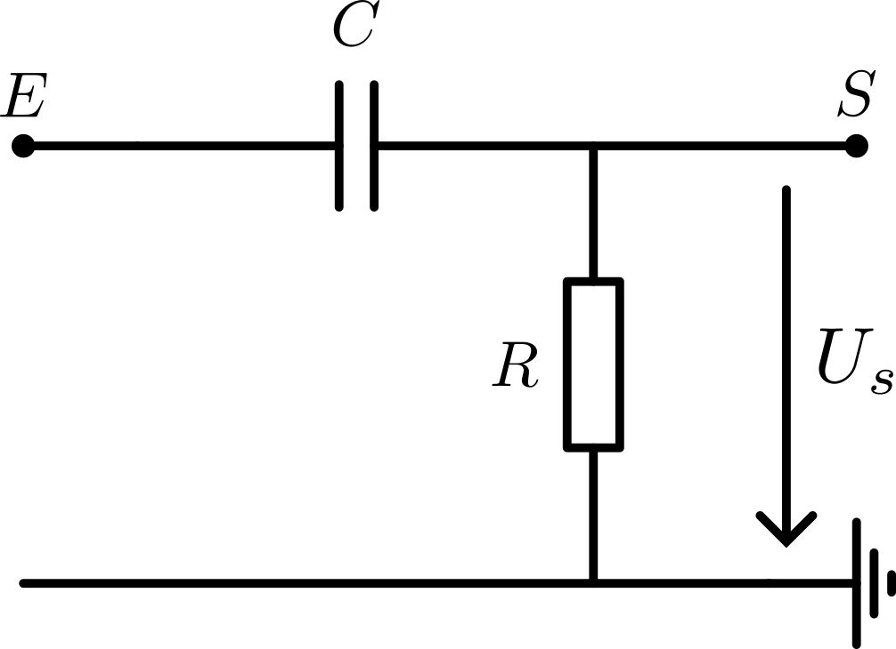

# Filtre analogique

Nous avons ainsi besoin d'un filtre passe-haut
En nous inspirant du prosit 2, nous pouvons utiliser le même filtre avec des composants de différentes valeurs.

Soit $P_f$ la plage de fréquences transmises. (ex. $P_f = [20, 20.6]$kHz).

Dans le cas ou nous utilisons un pass haut. Nous pourrons définir la fréquence de coupure $f$ comme $f=\min(P_f)$. Or, pour s'assurer que nous pourrons capter proprement le signal. Nous pouvons placer la fréquence de coupure un peut avant. (ex. $f = 19$kHz).

En observant notre schéma. Nous pouvons remarquer qu'il sagit en fait d'un pont diviseur de tension.

$$
\underline {U_S} = \frac {\underline {Z_R}} {\underline{Z_C} + \underline{Z_R}} U_E
$$

out $Z_R$ et $Z_C$ représentent l'inpédence de la résistance $R$ et du condensateur $C$.

Nous savons que l'expression de l'impédance est 
$$
\underline Z = R + j(X_L - X_C)
$$

ou $R$ représente la résistance et $X_L$ et $X_C$ la réactivité inductrice et condensatrice.

Nous pouvons ainsi calculer l'impédence des deux composants du pont diviseur de tension.

$$
\underline{Z_R} = R\\
\underline{Z_C} = -jX_C
$$

Sachant que
$$
X_C = \frac 1 {\omega C}
$$
ou $\omega$ représente la pulsation tel que $\omega = 2\pi f$

$$
\underline{Z_C} = \frac 1 {j\omega C}
$$

Donc,
$$
U_S = \frac {R} {R-jX_C} U_E
$$

Afin de détermier l'expression de la fréquence de coupure en fonction des carateristiques de nos composents. Nous avons besoin de définier la fréquence de coupure.

Nous savons que pour $f = f_c$ $H(\omega) = -3dB$

$$
H(2\pi f_c) = 
$$

Ainsi, nous avons :
$$
U_S = \frac {U_E} 2
$$

Nous pouvons injecter l'expresion de $U_S$,

$$
\frac {R} {R-jX_C} U_E = \frac {U_E} 2
$$

en divisant par $U_E$
$$
\frac {R} {R-jX_C} = \frac 1 2
$$

Nous pouvons diviser par $R$ et inverser notre expression
$$
2R = R - jX_C
$$

Ainsi,
$$
R = -jX_C
$$

Or, ni la résistance, ni la charge, ni la fréquence ne peuvent être négative. Le signe de $X_C$ provient du déphasage, ce qui lui donne une valeur négative. Étant donné que nous cherchons la valeur des composents. Nous pouvons nous intéresser au module.

$$
\lvert jX_C \lvert = X_C  
$$

Donc,
$$
R = X_C
$$

En injectant l'expression de $X_C$
$$
\frac 1 {\omega C} = R
$$

$$
\omega = \frac 1 {RC}
$$

$$
2\pi f = \frac 1 {RC}
$$

$$
f = \frac 1 {2\pi RC}
$$